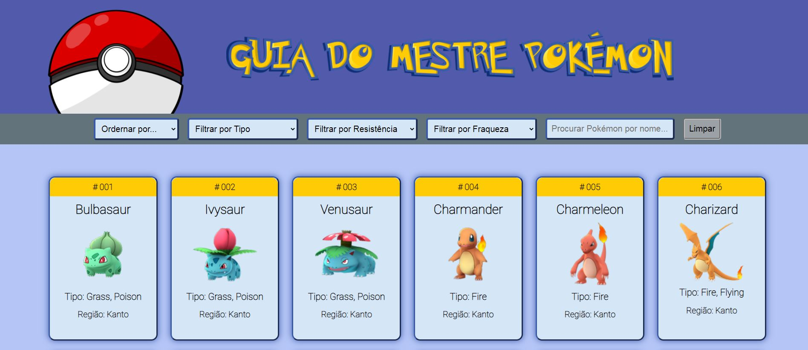
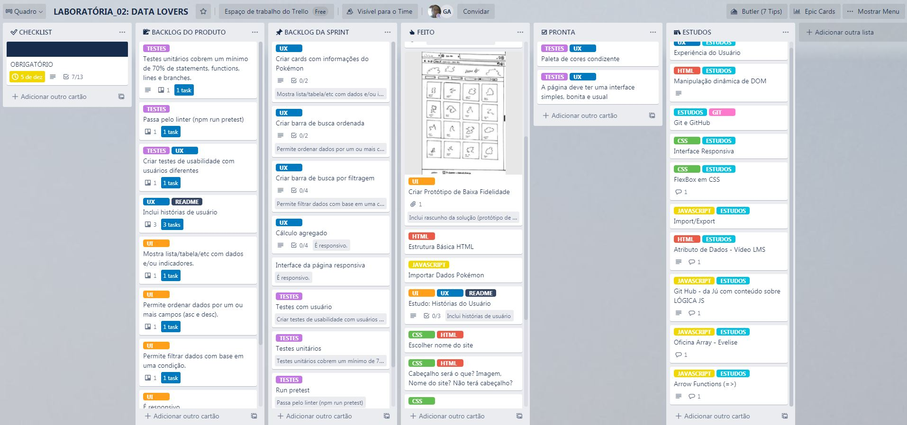

# Data Lovers

## Índice

* [1. Introdução](#1-introdução)
* [2. Desenvolvimento](#2-desenvolvimento)
* [3. Testes](#testes)
* [4. Objetivo de Aprendizagem](#4-objetivodeaprendizagem)

***

## 1. Introdução

Para este projeto foi proposto pela Laboratória o desenvolvimento de uma aplicação web que permite a visualização e manipulação de dados.
Todo o precesso de criação da aplicação Guia do Mestre Pokémon foi desenvolvida em conjunto, pelas alunas/futuras Desenvolvedoras Front-end Eliane Gomes Cardozo e Gabrielle Almeida.

## 2. Desenvolvimento
  ###  :heavy_check_mark: Sobre a aplicação

A aplicação chamada de Guia do Mestre Pokémon foi criada, para os fãs da franquia mundialmente conhecida como Pokémon, ela permite aos usuários  a visualização de dados dos Pokémon da 1ª Geração (1996-1999) e da 2ª Geração (1999-2002), é possível ver a imagem de cada espécie e também outros detalhes, tais como o seu tipo e sua numeração e navegar entre os cards e descobrir quais são as fraquezas e resistência de cada um deles. 

  ### :heavy_check_mark: Identificação dos usuários

Para conhecer quem seriam os usuários, realizamos uma pesquisa utilizando o [Google Forms](https://www.google.com/intl/pt-BR/forms/about/). A partir desta pesquisa foi possível identificar as necessidades dos usuários para que aplicação Guia do Mestre Pokémon fosse elaborada para os usuários que já conhecem a franquia e também para aqueles que desejam descobrir um pouco mais sobre este mundo. Com essas informações foi possível traçar o perfil das personas.

_Personas_

  #### :heavy_check_mark: Histórias de usuários

Com base nas necessidades dos usuários, foi possível elaborar quatro histórias de usuário:

1. Eu, como usuário desejo visualizar a espécie de Pokemón como: sua imagem, seu  nome, tipo, sua força, fraqueza para saber suas informações mais básicas;

2. Eu, como usuário desejo ordernar todos os personagens por ordem alfabética crescente e decrescente e pelo seu número para acessar as informações do Pokémon escolhido;

3. Eu, como usuário desejo procurar os personagens pelo seu nome para acessar as informações mais rapidamente;

4. Eu, como usuário desejo saber quantos Pokémons de cada tipo foram encontrados para sanar minha curiosidade;

As histórias do usuários são um meio para estabelecer como deverá ser a nossa aplicação ela  nos auxilia na definição do protótipo e da aplicação em sí, com elas nos embasamos em pequenas entregas para assim construir uma aplicação que entrega desde o início pequenas resoluções ao usuário. 

  ### :heavy_check_mark: Interface

O objetivo principal foi oferecer uma interface simples, bonita e usual. Foi utlizada uma paleta de cores baseada no Pokémon Lugia (n°249) e também na logo principal.

_Wireframe Inicial_

_Interface Final_

  ###  :heavy_check_mark: Planejamento

Quanto ao planejamento, foi utilizado uma aplicação de gerenciamento de tarefas chamada Trello, que permitiu a dupla, o acompanhamento diário de todo o processo de estudo e pesquisa que envolveram o desenvolvimento da aplicação Guia do Mestre Pokémon.[Trello](https://trello.com).

_Planejamento Trello_

## 3. Testes

Realizamos testes com pessoas próximas que se dispuseram a dar feedback a respeito da usuabilidade e também foram desenvolvidos testes unitários para identificar possíveis falhas nas funções.

## 4. Objetivos de aprendizagem

Para o projeto foi necessário aprender alguns conceitos que englobam HTML, CSS, JavaScript e Testing.

***